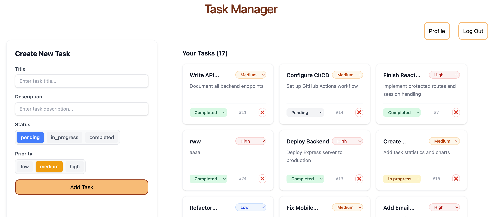

# Task Manager

TaskManager is a full-stack web application that helps users efficiently manage their daily tasks with secure authentication and an intuitive user interface.

## Live Demo

🚀 **Application:** https://taskmanager-2ca.pages.dev/

- **Demo Video:** https://www.youtube.com/watch?v=k9rYWpddX4Y
- **Frontend Hosting:** Cloudflare Pages
- **Backend Hosting:** Render
  > [!NOTE]
  > The backend is hosted on Render's free tier and may take 30–60 seconds to wake up after a period of inactivity.

## Table of Content

- [Description](#description)
- [Key Feature](#key-features)
- [Technologies Used](#technologies-used)
- [Prerequisites](#prerequisites)
- [Installation](#installation)
- [Screen Shot](#screen-shot)
- [Api Documentaion](#api-documentation)
- [End Notes](#end-notes)

## Description

TaskManager is a full-stack task management application that helps users organize, track, and manage their daily tasks through a modern and responsive web interface. Users can securely create accounts, authenticate using JWT-based authentication, and manage their personal task lists with features such as task creation, updating, completion tracking, deletion, and AI-assisted task entry.

Instead of filling in a form for every task, users can add one or multiple tasks by writing a prompt, making task capture faster and more conversational. The frontend is built with React, TypeScript, JavaScript, JSX, Vite, and Tailwind CSS, providing a fast and responsive user experience. The backend is powered by Node.js and Express.js, exposing RESTful APIs for user authentication and task management. Task and user data are stored in a PostgreSQL database hosted on Supabase, while JSON is used for communication between the frontend and backend.

Security is implemented using JWT authentication, HTTP-only cookies, password hashing, and protected API endpoints to ensure that users can access only their own data. The application is deployed using Cloudflare Pages for the frontend and Render for the backend, demonstrating a complete production-ready full-stack architecture.

This project showcases practical full-stack development skills, including frontend development, backend API design, database integration, authentication and authorization, deployment, and modern web application architecture.

# Key Features

- 🔐 Secure user registration and login using JWT authentication
- 🔄 Automatic JWT verification and authentication persistence across page refreshes.
- 👤 User-specific task management with protected routes and APIs
- ✅ Create, view, update, and delete tasks (CRUD operations)
- 📌 Mark tasks as completed or pending
- 🔄 Persistent task storage using PostgreSQL
- 🍪 Secure authentication using HTTP-only cookies
- 📱 Responsive user interface built with React and Tailwind CSS
- ⚡ Fast frontend development and build process with Vite
- 🔍 Real-time task updates without page refreshes
- 🛡️ Authorization checks to ensure users can access only their own tasks
- 🌐 RESTful API architecture using Node.js and Express.js
- 🚀 Production deployment with Cloudflare Pages (Frontend) and Render (Backend)
- 🎨 Clean and modern user experience
- 📝 Form validation and error handling for improved reliability
- 🤖 Add one or multiple tasks using AI-powered prompts instead of filling a form

## Technologies Used

- **Frontend**: React, TypeScript, JavaScript, JSX, Tailwind CSS, Vite

- **Backend**: Node.js, Express.js

- **Database**: PostgreSQL (Supabase)

- **Authentication & Security**: JSON Web Tokens (JWT), HTTP-Only Cookies, bcryptjs, cookie-parser, CORS

- **API & Data Format**: REST API, JSON

- **Database Connectivity**: postgress (node.js package)

- **Environment Management**: dotenv

- **Version Control**: Git, GitHub

- **Deployment**: Cloudflare Pages (Frontend), Render (Backend)

- **Package Management**: npm

## Prerequisites

Node < v24.15.0\
Npm < 11.12.1

## Installation

**1. Clone the repository:**

```Bash
git clone https://github.com/vishnurvp2/taskmanager.git
cd taskmanager
```

**2. Install dependencies:**

1. Backend and Frontend dependencies

```Bash
(cd backend && npm install)
(cd frontend && npm install)
```

**3. Create environment files**

```Bash

printf "PORT=\nDATABASE_URL=\nJWT_SECRET=\nGEMINI_API_KEY=\n" > backend/.env.development
printf "PORT=\nDATABASE_URL=\nJWT_SECRET=\nGEMINI_API_KEY=\n" > backend/.env.production

printf "VITE_API_URL=\n" > frontend/.env.development
printf "VITE_API_URL=\n" > frontend/.env.production
```

- populate environment variables
- save the env files
- create working PostgreSQL database hosted on Supabase or any other provides
- provide database connection string in the DATABASE_URL variable.
  > Note: The application is configured to use a PostgreSQL database hosted on Supabase by default. If you prefer, you can modify the database configuration and use any PostgreSQL-compatible database provider instead.

**4. Run the Servers**

1. Backend server

```bash
npm run dev
```

2. Frontend server

```bash
npm run dev
```

## Screen shot



## API Documentation

Backend server running on `http://localhost:3000`

| Endpoints            | Method | Input                         | Output                  |
| -------------------- | ------ | ----------------------------- | ----------------------- |
| `/`                  | `GET`  | -                             | `Hello` string          |
| `/auth/verify_user`  | `GET`  | user_id extracted from cookie | `user` Object           |
| `/auth/login_signup` | `POST` | `email`, `password`           | `user` Object           |
| `/auth/logout`       | `GET`  | -                             | deletes cookie          |
| `/tasks`             | `GET`  | -                             | Array of `Task` Objects |
| `/tasks`             | `POST` | `Task` Object                 | `Task` Object           |
| `/tasks/edit`        | `POST` | `Task` Object                 | `Task updated` String   |
| `/tasks/delete`      | `POST` | `taskId` Number               | `deleted` String        |

## End Notes

Thank you
